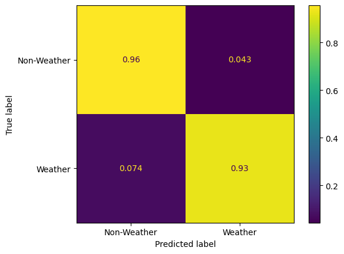

____
# Model Information
___
This model is trained on the same data in the same configuration as in DesRosiers and Bell 2023, and should produce extremely similar results to it. 
  
Below is the confusion matrix for the model when run on the training dataset - nearly identical to the figure producd in
the manuscript.
   
