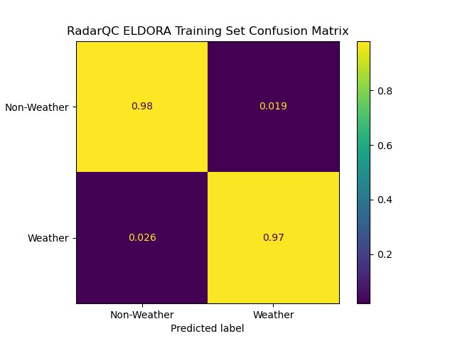

____
# Model Information
___
This model is trained on the same data as in DesRosiers and Bell 2023, and should produce extremely similar results to it. Configuration info is provided in [config.txt](config.txt). An important note here is to utilize the `replace_missing=false` keyword argument in the calculate_features call. The original code functioned by replacing missing values in the cfradial with fill values, which would result in unrealistic distributions of dervied parameters such as standard deviation. Setting `replace_missing=false` ignores these values, and produces much better results. 
  
Below is the confusion matrix for the model when run on the training dataset - nearly identical to the figure producd in
the manuscript.
   
